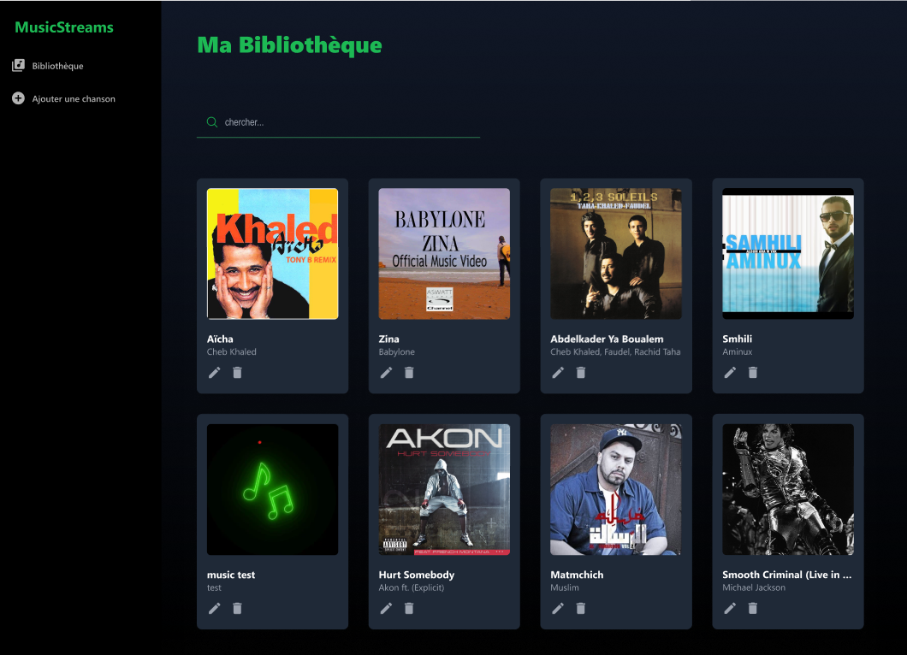
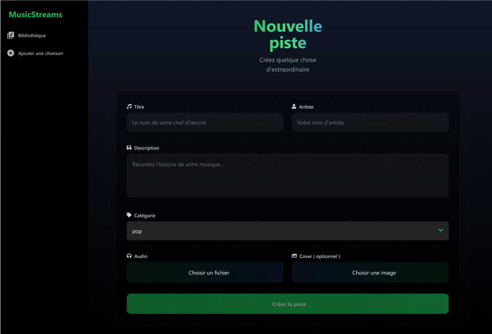
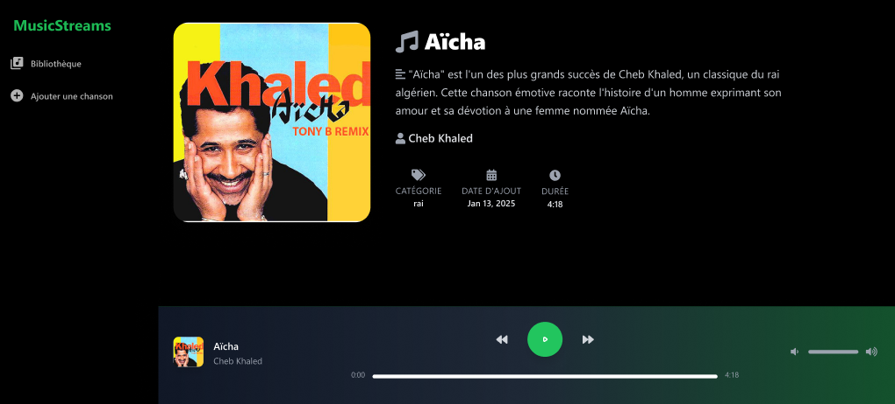

# 🎵 MusicStream

Une application web moderne de streaming musical développée avec Angular et Docker.

## 📋 Table des matières
- [Aperçu](#-aperçu)
- [Fonctionnalités](#-fonctionnalités)
- [Technologies](#-technologies)
- [Prérequis](#-prérequis)
- [Installation](#-installation)
- [Utilisation](#-utilisation)
- [Docker](#-docker)
- [Structure du projet](#-structure-du-projet)
- [Tests](#-tests)
- [Contribution](#-contribution)

## 🎯 Aperçu

MusicStream est une application de streaming musical qui permet aux utilisateurs de télécharger, organiser et écouter leur musique. L'interface utilisateur est inspirée des meilleures pratiques , offrant une expérience utilisateur fluide et moderne.

## ✨ Fonctionnalités

- 🎵 Lecture de musique avec contrôles avancés
- 📁 Gestion de bibliothèque musicale
- 🔍 Recherche de pistes
- 📝 Édition des métadonnées des pistes
- 🖼️ Support des pochettes d'albums
- 🎨 Interface utilisateur moderne et responsive
- 💾 Stockage local avec IndexedDB

## 🎨 Interface utilisateur




## 🛠 Technologies

- Angular 17
- TypeScript
- TailwindCSS
- NgRx
- IndexedDB
- Docker
- Node.js

## 📋 Prérequis

- Node.js (v20+)
- npm (v10+)
- Docker (optionnel)
- Angular CLI (`npm install -g @angular/cli`)

## 🚀 Installation

1. Cloner le dépôt :
````bash
git clone https://github.com/asmaabarj/music-stream.git
cd music-stream
````
2. Installer les dépendances :
````bash
npm install
````
3. Lancer l'application :
````bash
npm run start
````

## 💻 Utilisation

L'application sera accessible à `http://localhost:4200/`

## 📁 Structure du projet

src/
├── app/
│ ├── components/ # Composants Angular
│ ├── models/ # Interfaces et types
│ ├── services/ # Services
│ ├── store/ # État NgRx
│ └── pipes/ # Pipes personnalisés
├── assets/ # Ressources statiques
└── styles/ # Styles globauxDocker.

## 🧪 Tests

Pour exécuter les tests unitaires :
````bash
npm run test
````
## 📋 Planification sur Jira
- Lien vers le tableau Jira : [Accéder à Jira](https://asmaabarj5.atlassian.net/jira/software/projects/MS/boards/463)

## 🎨 Lien de Maquettage sur Figma
  - [Voir le projet sur Figma](https://www.figma.com/design/vGSNPkLdSKKGItC7ROzPBc/MusicStream?node-id=0-1&t=qhAMgK75mmQ79O6S-1)
